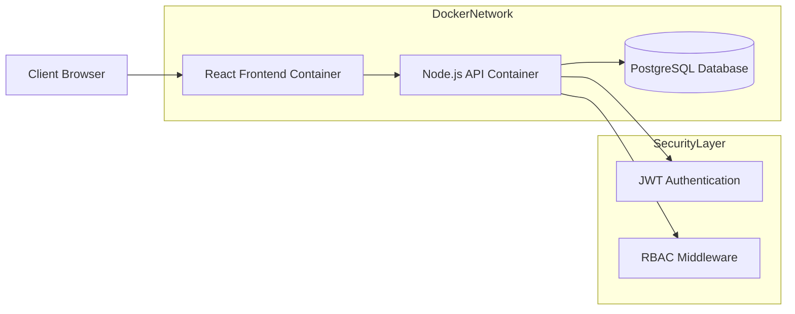
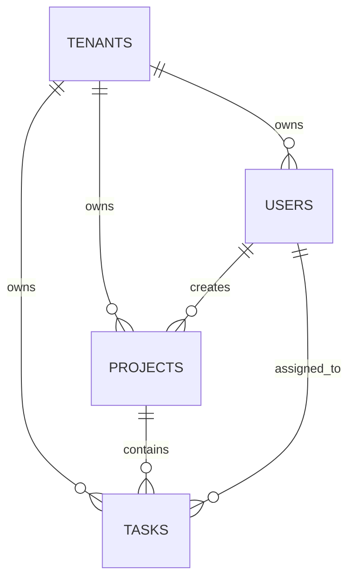

# Multi-Tenant SaaS Platform

## Overview

A production-grade **B2B Multi-Tenant SaaS Platform** designed to showcase real-world system design concepts such as **Multi-Tenancy**, **Strict Data Isolation**, and **Role-Based Access Control (RBAC)**. Each organization (Tenant) operates within a completely isolated workspace while sharing the same application infrastructure.

This project demonstrates how modern SaaS products (e.g., Jira, Notion, Asana) manage multiple organizations securely within a single system.

---

## Core Concepts Demonstrated

* **Multi-Tenancy with Isolation** using `tenant_id` at the database level
* **RBAC (Role-Based Access Control)** across system roles
* **JWT Authentication & Authorization**
* **Secure Backend APIs** with validation and access guards
* **Scalable SaaS Architecture** suitable for enterprise use

---

## User Roles & Permissions

### 1. Super Admin (System Level)

* Manage all registered tenants
* Monitor system-wide usage
* No access to tenant-specific operational data

### 2. Tenant Admin (Organization Level)

* Manage organization users
* Assign roles and permissions
* Create and manage projects and tasks

### 3. Standard User

* Access only assigned projects
* Create and update tasks
* Cannot manage users or organization settings

---

## Key Features

### 🔐 Security & Authentication

* JWT-based authentication
* Password hashing using **Bcrypt**
* Secure CORS configuration
* Middleware-based role and tenant validation

### 🏢 Multi-Tenancy Architecture

* Centralized database with logical isolation
* Every entity scoped using `tenant_id`
* Protection against cross-tenant data leaks

### 📊 Project & Task Management

* Tenant-specific projects
* Task assignment with priorities and deadlines
* Task status lifecycle (Todo → In Progress → Completed)

### 👥 Team Management

* Tenant Admins can:

  * Invite users
  * Remove users
  * Change roles

### 🧑‍💻 Admin Dashboards

* **Super Admin Dashboard**: Global tenant overview
* **Tenant Dashboard**: Organization-specific analytics

### 🎨 Responsive UI

* Clean and intuitive React dashboard
* Mobile-friendly layout using Flexbox & Grid

---

## Technology Stack

### Frontend

* **React.js (v18)**
* React Router DOM (v6)
* Context API for state management
* Axios for API communication
* CSS3 (Flexbox & Grid)

### Backend

* **Node.js (v18)**
* Express.js
* Prisma ORM
* JWT Authentication
* Express Validator

### Database & DevOps

* PostgreSQL (v15)
* Docker & Docker Compose
* Alpine Linux containers

---

## System Architecture

```
Client (React)
     |
REST APIs (JWT Secured)
     |
Node.js + Express
     |
Prisma ORM
     |
PostgreSQL (tenant_id scoped data)
```

---

## Installation & Setup

### Prerequisites

* Docker & Docker Compose (Recommended)
* Node.js v18+
* PostgreSQL (Local setup only)

---

## Method 1: Docker Setup (Recommended)

### Step 1: Clone Repository

```bash
git clone <your-repo-url>
cd Multi-Tenant-SaaS-Platform
```

### Step 2: Configure Environment Variables

Create `.env` in root (or verify `docker-compose.yml`):

```env
POSTGRES_USER=postgres
POSTGRES_PASSWORD=postgres
POSTGRES_DB=saas_db
```

### Step 3: Run Application

```bash
docker-compose up -d --build
```

### Step 4: Access Application

* Frontend: [http://localhost:3000](http://localhost:3000)
* Backend Health: [http://localhost:5000/api/health](http://localhost:5000/api/health)

✔ Migrations and seed data run automatically

---

## Method 2: Local Development Setup

### Backend Setup

```bash
cd backend
npm install
cp .env.example .env
npx prisma migrate dev --name init
npm run seed
npm start
```

### Frontend Setup

```bash
cd frontend
npm install
npm start
```

---

## Environment Variables

| Variable     | Description                  | Default                                        |
| ------------ | ---------------------------- | ---------------------------------------------- |
| PORT         | Backend server port          | 5000                                           |
| DATABASE_URL | PostgreSQL connection string | Docker value                                   |
| JWT_SECRET   | JWT signing secret           | Custom                                         |
| FRONTEND_URL | Allowed CORS origin          | [http://localhost:3000](http://localhost:3000) |

---

## API Documentation

Base URL (Local): `http://localhost:5000/api`

All protected endpoints require the following header:

```
Authorization: Bearer <JWT_TOKEN>
```

Token expiry: **24 hours**

---

## 1. System

### Health Check

* **Endpoint:** `GET /health`
* **Access:** Public

**Response (200 OK)**

```json
{
  "status": "ok",
  "database": "connected"
}
```

---

## 2. Authentication

### Register Tenant

* **Endpoint:** `POST /auth/register-tenant`
* **Access:** Public

```json
{
  "tenantName": "Acme Corp",
  "subdomain": "acme",
  "adminEmail": "admin@acme.com",
  "password": "SecurePassword123"
}
```

**Response (201)**

```json
{
  "message": "Tenant registered successfully",
  "tenantId": "uuid-string"
}
```

### Login

* **Endpoint:** `POST /auth/login`
* **Access:** Public

```json
{
  "email": "admin@acme.com",
  "password": "SecurePassword123"
}
```

**Response (200)**

```json
{
  "token": "jwt-token",
  "user": {
    "id": "uuid",
    "email": "admin@acme.com",
    "role": "tenant_admin",
    "tenantId": "uuid"
  }
}
```

### Get Current User

* **Endpoint:** `GET /auth/me`
* **Access:** All authenticated roles

---

## 3. Tenant Management (Super Admin)

### List Tenants

* **Endpoint:** `GET /tenants`
* **Access:** Super Admin

### Get Tenant Details

* **Endpoint:** `GET /tenants/:id`
* **Access:** Super Admin

### Update Tenant

* **Endpoint:** `PUT /tenants/:id`
* **Access:** Super Admin

---

## 4. User Management (Tenant Admin)

### List Users

* **Endpoint:** `GET /tenants/:tenantId/users`

### Create User

* **Endpoint:** `POST /tenants/:tenantId/users`

### Update User

* **Endpoint:** `PUT /users/:id`

### Delete User

* **Endpoint:** `DELETE /users/:id`

---

## 5. Project Management

### List Projects

* **Endpoint:** `GET /projects`

### Create Project

* **Endpoint:** `POST /projects`

### Get Project

* **Endpoint:** `GET /projects/:id`

### Update Project

* **Endpoint:** `PUT /projects/:id`

---

## 6. Task Management

### List Tasks

* **Endpoint:** `GET /projects/:projectId/tasks`

### Create Task

* **Endpoint:** `POST /projects/:projectId/tasks`

### Update Task Status

* **Endpoint:** `PATCH /tasks/:id/status`

### Update Task

* **Endpoint:** `PUT /tasks/:id`

---

## Seeded Test Credentials

### Super Admin

* Email: [superadmin@system.com](mailto:superadmin@system.com)
* Password: Admin@123

### Tenant Admin (Demo Company)

* Email: [admin@demo.com](mailto:admin@demo.com)
* Password: Admin@123
* Subdomain: demo

---

## Future Enhancements

* OAuth (Google / GitHub login)
* Subscription & Billing (Stripe)
* Audit Logs & Activity Tracking
* Advanced Role Permissions
* Microservices-based scaling

---

## Project Purpose

This project is built for **portfolio, interviews, and real-world SaaS architecture demonstration**, showcasing backend security, scalable design, and full-stack engineering skills.

---

## Frontend (React) – Getting Started

The frontend of this platform is built using **React 18** and was initially bootstrapped with **Create React App (CRA)**. The default CRA documentation has been streamlined and adapted specifically for this SaaS project.

---

### Frontend Scripts

From the `frontend` directory, you can run:

#### `npm start`

Runs the React application in development mode.

* URL: [http://localhost:3000](http://localhost:3000)
* Automatically reloads on code changes
* Displays linting errors in the console

#### `npm test`

Runs unit tests in interactive watch mode.
Useful for validating UI components and utilities.

#### `npm run build`

Creates an optimized production build in the `build/` folder:

* Minified and optimized assets
* Cache-friendly hashed filenames
* Ready for deployment via Docker or static hosting

#### `npm run eject`

> ⚠️ One-way operation (not recommended)

Ejects CRA configuration (Webpack, Babel, ESLint) for full control.
This project **does not require ejecting** and follows CRA best practices.

---

### Frontend Responsibilities

* User authentication & session handling
* Role-based route protection (RBAC)
* Tenant-aware API communication
* Project & task management UI
* Responsive dashboard layouts

---

### Frontend Architecture

* **Context API** for global auth & tenant state
* **React Router v6** for protected routing
* **Axios** with JWT interceptors
* Modular component structure for scalability

---

### Notes

* CRA boilerplate sections (PWA, bundle analysis, advanced config) were intentionally omitted to keep documentation concise and project-focused.
* For React fundamentals, refer to the official React documentation.

---

## System Architecture Document

**Project:** Multi-Tenant SaaS Project Management System
**Version:** 1.0
**Author:** Lead Developer

---

## Architecture Overview

The system follows a **containerized three-tier architecture** designed for scalability, security, and strict tenant isolation. All services are orchestrated using **Docker Compose**, ensuring consistency across development and deployment environments.

---

## High-Level Architecture



---

## Component Breakdown

### Frontend Layer

* **Tech:** React.js
* **Port:** 3000
* **Responsibilities:**

  * UI rendering and routing
  * JWT storage and session handling
  * Tenant-aware API calls

Tenant context is derived from login response or subdomain mapping.

---

### Backend Layer

* **Tech:** Node.js, Express.js
* **Port:** 5000
* **Responsibilities:**

  * Authentication & authorization
  * Business logic execution
  * Tenant isolation enforcement

**Isolation Strategy:**

* `tenant_id` extracted from JWT
* Automatically injected into all database queries
* Prevents cross-tenant data access

---

### Database Layer

* **Tech:** PostgreSQL 15
* **Model:** Shared Database, Shared Schema

Each tenant-owned table includes a mandatory `tenant_id` column used as the logical isolation key.

---

## Database Design (ERD)



---

## API Architecture

The backend exposes **RESTful APIs** grouped into logical modules. All responses follow a consistent structure:

```json
{
  "success": true,
  "message": "Operation completed successfully",
  "data": {}
}
```

---

### Authentication

* `/api/auth/register-tenant`
* `/api/auth/login`
* `/api/auth/me`

### Tenant Management (Super Admin)

* `/api/tenants`
* `/api/tenants/:tenantId`

### User Management

* `/api/tenants/:tenantId/users`
* `/api/users/:userId`

### Project & Task Management

* `/api/projects`
* `/api/projects/:projectId/tasks`
* `/api/tasks/:taskId`

---

## Key Architecture Benefits

* Strong tenant isolation
* Scalable container-based deployment
* Clean separation of concerns
* Enterprise-grade RBAC security

---

## Product Requirements Document (PRD)

**Project:** Multi-Tenant SaaS Project Management System
**Version:** 1.0
**Status:** Approved for Development

---

## 1. User Personas

### Super Admin (System Owner)

**Responsibilities**

* Monitor platform health and tenant usage
* Manage tenant subscriptions and status
* Prevent abuse and manage enterprise onboarding

**Goals**

* Platform stability and growth
* Visibility into global usage

**Pain Points**

* Lack of centralized tenant insights
* Manual subscription management risks

---

### Tenant Admin (Organization Manager)

**Responsibilities**

* Manage users, roles, and permissions
* Oversee projects and tasks
* Maintain tenant security

**Goals**

* Efficient team workflows
* Secure organization data

**Pain Points**

* Slow onboarding
* Limited visibility into team progress

---

### End User (Team Member)

**Responsibilities**

* Manage assigned tasks
* Collaborate on projects
* Track deadlines

**Goals**

* Clear priorities
* Minimal administrative overhead

**Pain Points**

* Cluttered interfaces
* Missed deadlines

---

## 2. Functional Requirements

### Authentication & Authorization

* Tenant registration with unique subdomain
* JWT-based stateless authentication (24h expiry)
* Role-Based Access Control (Super Admin, Tenant Admin, User)
* Tenant-level data isolation enforced on every request

---

### Tenant Management

* Default Free plan assignment
* Tenant listing and status management by Super Admin
* Immediate enforcement of subscription limits

---

### User Management

* User creation within subscription limits
* Tenant-scoped email uniqueness
* Immediate access revocation on deactivation

---

### Project Management

* Project lifecycle management
* Tenant dashboard with project statistics
* Cascade deletion of tasks

---

### Task Management

* Task creation with priority and due dates
* Tenant-scoped assignment
* Status updates and filtering

---

## 3. Non-Functional Requirements

* **Performance:** 95% API responses < 200ms under load
* **Security:** Bcrypt password hashing (10+ salt rounds)
* **Scalability:** Horizontal scaling via Docker
* **Availability:** Health checks for backend and database
* **Portability:** One-command deployment using Docker Compose
* **Usability:** Fully responsive UI (mobile & desktop)

---

## PRD Value

This PRD ensures alignment between **business goals**, **system architecture**, and **engineering implementation**, making the project suitable for real-world SaaS product development and technical interviews.


